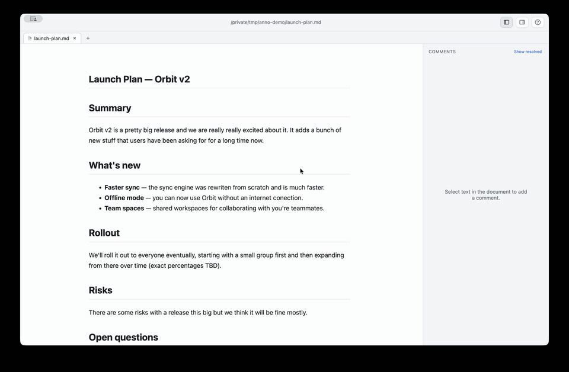

# anno

Comment on your markdown like you would in Google Docs — leave notes in the margin, and `anno` revises the document to address them for you. Review the changes, comment, and repeat until it's right.

```
highlight + comment  ──▶  anno revises via your Claude Code  ──▶  editor live-reloads
        ▲                                                              │
        └──────────────────────── you review ◀─────────────────────────┘
```

<p align="center">
  
</p>

> **Note:** anno was developed entirely with AI ([Claude Code](https://claude.com/claude-code)) and has only been tested on macOS.

## Getting started

```bash
npm i -g github:geminiicode/anno
```

Requires Node 18+ and an authenticated [Claude Code](https://code.claude.com/docs) `claude` CLI on your `PATH`. The editor is [Electron](https://www.electronjs.org/), so the install downloads its runtime (~100&nbsp;MB) the first time.

## Usage

```bash
anno review <file.md|folder>   # open the editor AND auto-address comments (full loop)
anno list <file.md>            # show comments and their statuses
```

### Claude Code

```
/plugin marketplace add geminiicode/anno   # register this repo as a plugin marketplace
/plugin install anno                        # install the anno plugin
/anno:review-md notes.md                    # review a doc from inside Claude Code
```

## Security note

`anno` runs Claude with `--permission-mode acceptEdits` and the document and comments are part of the prompt, so **reviewing a file effectively grants its author the ability to run Claude as you.** Two things to be clear about:

- **Edit is not directory-sandboxed.** Claude is limited to `Read,Edit` (not `Write`, so it can't create new files), but Edit can modify **any existing file your user account can write** — not just files in the document's folder. A malicious comment could target `~/.zshrc`, a config file, or source in a parent repo.
- **A folder tab shares one Claude session across all its documents.** Context carries between files (that's the point), which means a prompt-injecting comment in one document can influence Claude's revisions of the *other* documents in that folder for as long as the tab is open. Closing the tab is what ends the shared session.

Only run the loop on files and folders you trust.

## License

MIT — see [LICENSE](LICENSE).
</content>
