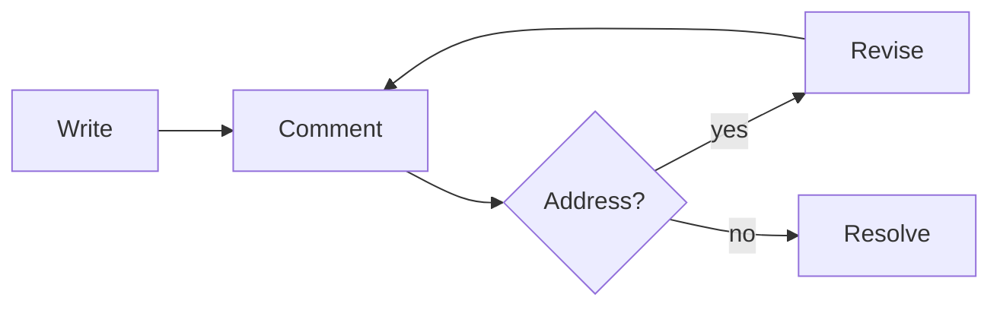

# Sample Document

This is a **sample markdown file** to test the commenter. Select any text and
click the 💬 Comment button that appears above your selection.

## How commenting works

Comments are anchored to the *exact text you highlight*. They are saved in a
per-user store under `~/.anno/store/`, keyed by this file's path — never beside
the document, so they stay out of `git status`.

- Select text to leave a comment
- Click a highlight or a card to jump between them
- Resolve a comment to grey it out, or delete it entirely

> Try highlighting this blockquote and leaving a note on it.

Links open in your default browser, not in this window — try the
[anno repo](https://github.com/geminiicode/anno).

### Code is supported too

```js
function hello(name) {
  return `Hello, ${name}`;
}
```

### And so are mermaid diagrams



**That's it — happy reading. 🙂**
